# 🏙️ CoreNow Code Intelligence & Codebase Analyzer

[](https://www.docker.com/)
[](https://ollama.com/)
[](https://www.python.org/)
[](https://threejs.org/)

Ein ganzheitliches, KI-gestütztes Tool zur statischen Code-Analyse, 3D-Metropolen-Visualisierung (Three.js), AST-Klassifikation und tiefgehenden Architektur-Audits mit lokalen LLMs.

---


## 🌟 Hauptfunktionen & Features

- **🌆 3D CodeCity Metropolis**: Visuelle Darstellung der Codebase als interaktive 3D-Stadt (Dateien als Gebäude, Höhe = LOC, Grundfläche = Komplexität, Farbe = semantische Rolle).
- **⚡ 0ms Delta-Cache (SHA-256)**: Inkrementelle Hashing-Architektur sorgt für blitzschnelle Wiederholungs-Scans ohne redundante Neuberechnung.
- **🎯 Semantische Intent-Rollen**: Automatische Zuordnung von Funktionen & Modulen zu Rollen (*Auth & Security*, *API & Commands*, *Data & State*, *UI & Presentation*, *Core Logic*, *Utils*, *Lifecycle*).
- **🤖 Lokale LLM-Integration**: Vollständig integrierter OpenAI-kompatibler Endpunkt (Ollama mit z.B. `qwen2.5-coder:7b`, `deepseek-coder` oder `llama3`).
- **📦 Staged Module Batches**: Chunks (4–8 Dateien) werden für gezielte Reviews mit Qualitäts-Scores und Risiko-Audits an das LLM übergeben.
- **📁 Multi-Format Ingestion**: Scannen lokaler Ordner oder direkter Upload von `.zip`-Archiven im Web-Interface.

---

## 🚀 Quickstart mit Docker & Docker Compose

Mit Docker Compose startest du die gesamte Plattform (Code-Analyzer Web-App + Ollama LLM + Automatischer Model-Download) mit einem einzigen Befehl.

### 1. Starten

```bash
docker compose up -d
```

Nach dem Start:
- **Web-Interface**: [http://localhost:8084/app](http://localhost:8084/app)
- **API Status**: [http://localhost:8084/api/status](http://localhost:8084/api/status)
- **Ollama Engine**: [http://localhost:11434](http://localhost:11434)

> Beim ersten Start lädt der `ollama-model-init`-Container automatisch das empfohlene 7B-Coder-Modell (`qwen2.5-coder:7b`) herunter.

### 2. Stoppen

```bash
docker compose down
```

---

## 📂 Eigenes Projekt / Codebase mounten

Um ein beliebiges lokales Projekt im Analyzer zu untersuchen, binde den Pfad deines Projekts als Volume in `/workspace` ein:

### Option A: In `docker-compose.yml` anpassen

```yaml
    volumes:
      - /pfad/zu/deinem/projekt:/workspace
```

### Option B: Direkt per `docker run` ausführen

```bash
# 1. Docker-Image bauen
docker build -t code-analyzer:latest .

# 2. Container mit gemountetem Projekt starten
docker run -d \
  --name code-analyzer \
  -p 8084:8084 \
  -v /pfad/zu/deinem/projekt:/workspace \
  -e LLM_URL=http://host.docker.internal:11434/v1/chat/completions \
  -e LLM_MODEL=qwen2.5-coder:7b \
  code-analyzer:latest
```

Sobald der Container läuft, kannst du im Web-UI `/workspace` als Pfad angeben oder über die API scannen:

```bash
curl -X POST http://localhost:8084/api/scan-local \
  -H "Content-Type: application/json" \
  -d '{"path": "/workspace", "use_cache": true}'
```

---

## 🧠 LLM-Konfiguration & Modelle

Standardmäßig ist `qwen2.5-coder:7b` vorkonfiguriert. Du kannst jedes beliebiges Modell in Ollama verwenden:

### Alternatives Modell herunterladen & nutzen

```bash
# In den Ollama-Container einloggen und Modell laden:
docker exec -it code-analyzer-ollama ollama pull deepseek-coder:6.7b
# oder
docker exec -it code-analyzer-ollama ollama pull llama3:8b
```

Passe anschließend die Umgebungsvariable in `docker-compose.yml` an:
```yaml
      - LLM_MODEL=deepseek-coder:6.7b
```

### ⚡ GPU-Beschleunigung (NVIDIA)

Wenn du das **NVIDIA Container Toolkit** installiert hast, aktiviere die GPU-Unterstützung in `docker-compose.yml`:

```yaml
    deploy:
      resources:
        reservations:
          devices:
            - driver: nvidia
              count: all
              capabilities: [gpu]
```

---

## ⚙️ Ports & Umgebungsvariablen

### Ports

| Port | Service | Beschreibung |
|---|---|---|
| `8084` | **Code-Analyzer** | Web-Frontend (`/app`) und REST-API |
| `11434` | **Ollama** | OpenAI-kompatibler LLM-Server |

### Umgebungsvariablen

| Variable | Standardwert | Beschreibung |
|---|---|---|
| `PORT` | `8084` | HTTP-Port des Analyzer-Servers |
| `LLM_URL` | `http://ollama:11434/v1/chat/completions` | Zieladresse des LLM-Endpoints |
| `LLM_MODEL` | `qwen2.5-coder:7b` | Name des verwendeten LLM-Modells |
| `CACHE_FILE` | `/workspace/.codebase_cache.json` | Speicherpfad für den SHA-256 Inkrementell-Cache |
| `RESULTS_FILE` | `/workspace/.codebase_results.json` | Speicherpfad für Analyse-Ergebnisse |

---

## 🛠️ REST-API Endpunkte

- `GET /app` – Web-Benutzeroberfläche (3D-Viewer, Mindmap, AST-Details, Code-Viewer).
- `GET /api/status` – Statusprüfung und Konfigurationsübersicht.
- `POST /api/scan-local` – Startet lokalen Scan eines Ordnerpfads (`{"path": "/workspace"}`).
- `POST /api/scan-zip` – Akzeptiert binäre ZIP-Payloads zur On-the-Fly-Analyse.
- `POST /api/batch-analysis` – Übergibt einen Modul-Batch an das LLM für tiefes Refactoring-Feedback.
- `POST /api/llm-critique` – Erzeugt eine ganzheitliche Architekturbewertung für die gesamte Codebase.
- `GET /api/analysis` – Liefert das aktuelle Analyseergebnis im JSON-Format.

---

## 🔍 Troubleshooting

- **Ollama antwortet langsam oder bricht ab**: 
  - Vergewissere dich, dass Docker ausreichend RAM zugewiesen ist (mindestens 8 GB für 7B-Modelle empfohlen).
  - Bei fehlender GPU fällt Ollama automatisch auf CPU-Inferenz zurück.
- **Keine Analyse im Browser sichtbar**: 
  - Klicke im Dashboard auf `Scan Directory` und trage `/workspace` ein.
- **Modell-Download hängt**:
  - Prüfe den Status mit `docker logs -f code-analyzer-model-init`.
